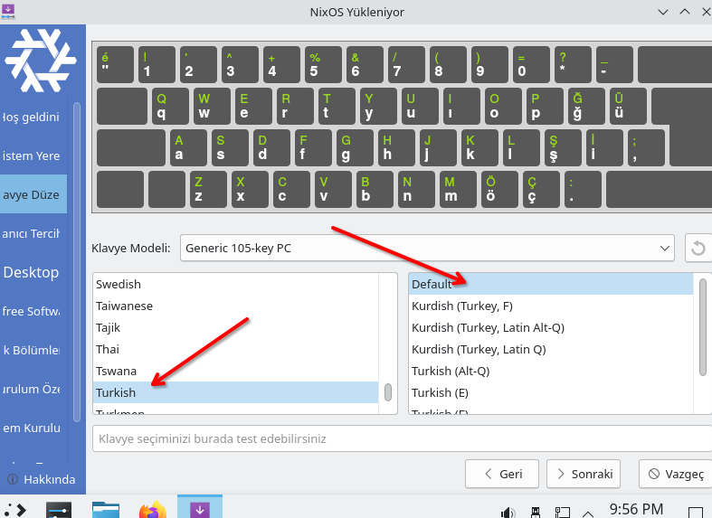
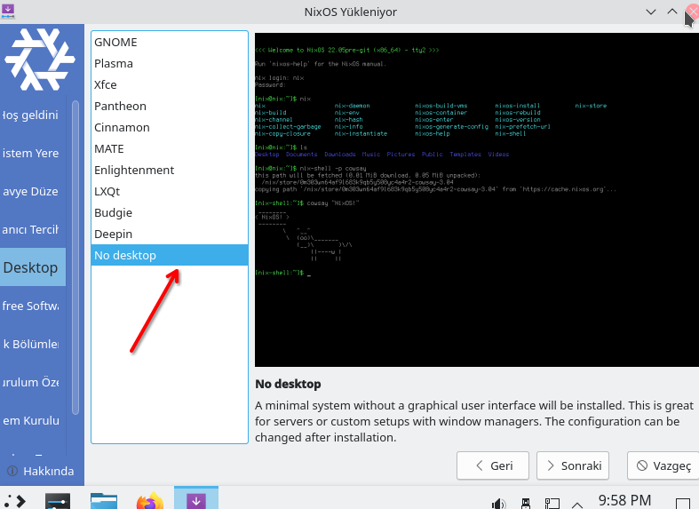
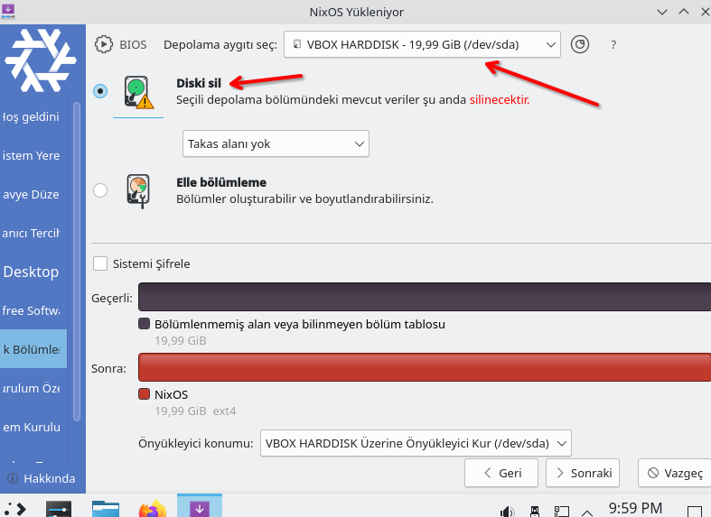
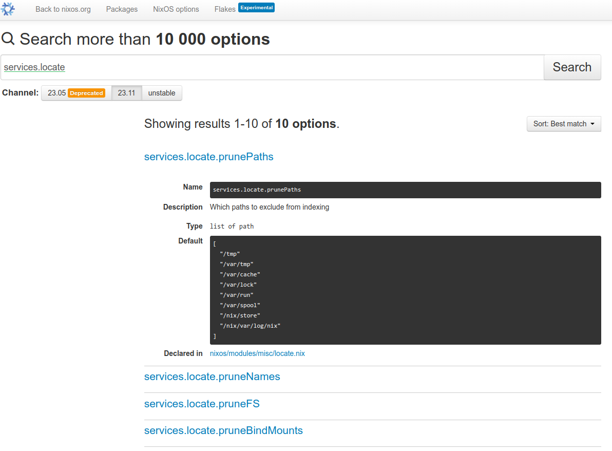

## 1. [NixOS: İşletim Sistemlerine Fonksiyonel Yaklaşım](0.NixOs.md)
2. [Nix Dili ve Özellikleri](1.NixLanguage.md)
3. [Nix Dili ile ilgili Alıştırmalar](2.NixLanguage-Exercises.md)
4. [Nix Dilinde Builtins Fonksiyonlar](3.NixLanguage-Builtins.md) 
5. [Nix Paket Yöneticisi](4.Nix-Package-Manager.md)
6. [Nix Paket Yöneticisi Shell, Profile Kavram ve Komutları](5.Nix-Package-Manager-Shell-Profile.md)
7. [Nix Flake Nedir?](6.Nix-Package-Flake-CustomDerivation.md)
8. [Birden Çok Paketi Aynı Repo Üzeriden Yayınlamak](7.Nix-Package-Flake-CustomDerivation-Multiple.md) 
9. [Override ve Overlay Kavramları](8.Nix-Package-Overlay-Overrride.md)
10. [Nix Paket Yöneticisi ile Developer ve Profile Ortamları Oluşturmak](9.Nix-Package-Manager-Developer-Shell-Profile.md) 
11. [Nix ile NixOs Konfigürasyonu](10.Nix-With-NixOS.md) 
12. [NixOs Module ve Option Kullanımı](11.Nix-Nixos-Modules-Options.md)
13. [NixOs Kurulumu ve Konfigürasyonu](12.Nix-NixOs-Configuration.md)
14. [NixOs'u Cloud ve Uzak Ortamlara Deploy Etmek](13.Nix-With-NixOS-Iso-Docker-Cloud.md)(Nix Öğreniyoruz 10) 

Bu yazıya doğrudan NixOs için geldiyseniz yani geçmiş yazıları okumadan doğrudan NixOs hakkında bir şeyler okumak için geldiyseniz ve NixOs hakkında da hiç bir bilginiz yoksa öncelikle serinin ilk yazısını okumanızı tavsiye ederim.

Girizgahı bir önceki yazıdan kopyalayarak konuya giriş yapalım.  

Konumuz NixOs, NixOs'a geçiş yapacağız ancak ilk etapta nasıl kurulur konusuna girmeyeceğiz. Çünkü ilk kurulum için aslında normal herhangi bir Linux dağıtımından farklı kurulmuyor. Ancak elimizde bir Nix konfigürasyonu varsa durum biraz değişiyor. Bu durumda sadece flake.nix dosyasını da içeren root dizini kurulum esnasında göstermemiz yeterli olacaktır.

Yazılarımı hazırlarken veya bir şeyler test ederken  Hashicorp Vagrant ürününü çok sık kullanıyorum. Kurulumu oldukça basit ve kullanışlı. Vagrant ile 2-3 satırlık bir komutla sanal makine ayağa kaldırabilirsiniz.

Windows, Mac ve Linux için kurulum yapılabiliyor. [Şu linkten](https://developer.hashicorp.com/vagrant/install?product_intent=vagrant) kurulumu yapabilirsiniz. 


Alttaki komutları terminalde veya powershell'de çalıştırarak bir NixOs işletim sistemi ayağa kaldırabilirsiniz.


```bash
vagrant init hennersz/nixos-23.05-flakes
vagrant up
```
Kurulum bittikten sonra ayrı terminal açıkken `vagrant ssh` komutu ile sanal makineye bağlanabilirsiniz. İleride de test etmek bir şey denemek için kullanabilirsiniz.

Ancak Vagrant'dan indireceğimiz image üzerinde bazı şeyler hazır geldiği için ben de sıfır ISO indirip kuracağım. Şu sayfada "NixOS: the Linux distribution" başlığında ISO dosyalarını indirebilirsiniz. Download ederken ve kurulumda kolaylık olması için GUI içeren bir versiyonu KDE  ve GNOME tercih edeceğiz ancak kurulum sırasında GUI seçmede yalın bir kurulum yapacağız. 


ISO'yu indirdikten sonra herhangi bir sanallaştırma sistemiyle kurulum yapabilirsiniz. Bir kullanıcı da VirtualBox olduğu için ben de onu tercih edeceğim. Zaman, ülke ve klavye ayarlarını Türkiye olarak seçmeyi unutmayın. Sanallaştırma sisteminizde verdiğiniz diskin de tamamını otomatik bölümlendirebilirsiniz.

Ben KDE ile devam ediyorum. Kurulum sırasındaki ayarları gösteren ekran görüntülerini altta veriyorum.










Kurulum bittiğinde sanal makineyi kapatıp ISO dosyasını çıkartıp tekrar başlatıyoruz. Sistem açıldığında login oluyoruz. İlk olarak büyük ihtimal sizin de  yaşayacağınız tahmin ettiğim ekran boyutu problemi ile karşılaşacağız. Bunu çözmeye uğraşmaya şuan hiç grek yok. Onun yerine SSH'ı aktif edip ssh ile bağlanacağız. Bunun için ileride bir çok kez açıp detaylı olarak çalışacağımız `/etc/nixos/configuration.nix` dosyasını nano ile açıyoruz. Nano dememin sebebi ise henüz sistemde vim'in kurulu olmaması. Alttaki satırları bulup açıklama satırını kapatıyoruz. Yani openssh'ı aktif edip firewall'ı kapatıyoruz.

```nix
  # Enable the OpenSSH daemon.
   services.openssh.enable = true;

  # Open ports in the firewall.
  # networking.firewall.allowedTCPPorts = [ ... ];
  # networking.firewall.allowedUDPPorts = [ ... ];
  # Or disable the firewall altogether.
   networking.firewall.enable = false;
```
Daha sonra terminal'den `sudo nixos-rebuild switch` komutu ile sistemi update ediyoruz. Aslında yaptığımız değişikliği sisteme uyguluyoruz. Artık ssh ile bağlanabiliriz. Bunun için host makinenizde terminal açıp `ssh kullanici_adiniz@192.168.1.1` komutuyla bağlanabilirsiniz. sanal makinenizin ip adresini ve kullanıcı adınız değiştirmeyi unutmazsınız ama ben yine de uyarayım :).

Daha sonra flake'i enable etmeniz gerekiyor. Bunun için login olduktan sonra `/etc/nixos/configuration.nix` dosyasına ` nix.settings.experimental-features = [ "nix-command" "flakes" ];` ekliyoruz. Dosyanın en üstüne hardware-configuration.nix yüklendikten sonra ekleyebiliriz.

```nix
# Edit this configuration file to define what should be installed on
# your system.  Help is available in the configuration.nix(5) man page
# and in the NixOS manual (accessible by running ‘nixos-help’).

{ config, pkgs, ... }:

{
  imports =
    [ # Include the results of the hardware scan.
      ./hardware-configuration.nix
    ];

 nix.settings.experimental-features = [ "nix-command" "flakes" ];

```

Daha sonra `/etc/nixos/flake.nix` dosyasını oluşturup içine alttaki satırları kopyalıyoruz.

```nix
{
  description = "Murat Cabuk NixOs Configuration";

  inputs = {
    nixpkgs.url = "github:NixOS/nixpkgs/nixos-23.11";
  };

  outputs = { self, nixpkgs, ... }@inputs: {

    nixosConfigurations.nixos = nixpkgs.lib.nixosSystem {
      system = "x86_64-linux";
      modules = [
        ./configuration.nix
      ];
    };
  };
}
```

Son olarak alttaki komutla komutu ile sistemi update ediyoruz. Nokta ile flake.nix dosyamızın aynı dizinde olduğunu, #nixos ile de flake.nix dosyasında `nixosConfigurations.nixos = ...` satırında yazan konfigürasyon adını yani burada nixos kelimesini girmiş oluyoruz. Eğer değiştirmediyseniz nixos yazıyor olması lazım. 

```bash
sudo nixos-rebuild switch --flake .#nixos
```
Evet artık Flake enable edilmiş bir NixOs sistemine sahibiz. Şimdi biraz neler yaptık tam olarak ne dönüyor onun üzerine konuşalım.

Daha önce de bahsetmiştik, bir flake output olarak alttakileri üretebilir.

- Nix Paketleri
- Nix Geliştirme Ortamları
- NixOS Modülleri (Nix Configuration)
- Nix Template'leri (hazır flake dosyaları)

İlk ikisini zaten gördük. Şimdi amacımız NixOs konfigürasyon ve modüllerini üretmek ve kullanmak. Sonuncusuna zaten hiç girmeyeceğiz, en azından bu yazı Nix Öğreniyoruz serisinde girmeyeceğiz.

Nix paketlerini oluştururken flake içinde hatırlarsanız mkDerivation fonksiyonu kullandık. Geliştirme ortamı oluşturmak için mkShell fonksiyonu kullanmıştık. Konfigürasyon oluşturmak için de `nixpkgs.lib.nixosSystem` fonksiyonunu kullanıyoruz, yukarıda da kullandığımız flake kodlarında da görebilirsiniz.


```nix
{
  description = "Murat Cabuk NixOs Configuration";

  inputs = {
    nixpkgs.url = "github:NixOS/nixpkgs/nixos-23.11";
  };

  outputs = { self, nixpkgs, ... }@inputs: {

    nixosConfigurations.nixos = nixpkgs.lib.nixosSystem {
      system = "x86_64-linux";
      modules = [
        ./configuration.nix
      ];
    };
  };
}
```

Burada en basit haliyle birden fazla konfigürasyonu yayınlayabileceğimizi de anlayabiliyoruz. Yani  `nixosConfigurations.nixos` satırındaki nixos kelimesini değiştirip başka bir konfigürasyon oluşturabiliriz. İkinci anlayabileceğimiz konu ise modules kavramı. Configuration.nix dosyamızın bir module olduğunu ve bir  liste içinde kullanıldığından dolayı birden fazla modülü bir arada kullanabileceğimizi anlayabiliyoruz.

## Module Kavramı

Şimdi Module kavramına biraz daha detaylı bakalım. Configuration dosyasını incelemeye başladığımızda bazı kavramları teorik olsa da öğrenmemiz gerekiyor. Öncelikle buradaki module kavramının Nix dilindeki module kavramıyla bir ilgisi yok.Nix dilindeki module kavramı generic bir tanım. Herhangi bir nix dosyasını import etmemiz module olarak adlandırılıyor. Buradaki module kavramı NixOs konfigürasyonu için kullanılan bir kavram ve bir standardı var. Alttaki gibi  tanımı var ancak ayrıca fonksiyon olarak da tanımlamak mümkün.

```nix

{
  imports = [
    # Diğer modüller
  ];

  options = {
    # Option tanımları.
    # Kullanıcıların bu modülü nasıl kullanabileceğini tanımlar.

  };

  config = {
    # Bu modüün ve import edilen diğer modüllerin option'larının ve diğer konfigürasyonalrın ayarlarndığı blok 
  };
}

```

Çoğunlukla options ve config bloklarına ihtiyaç olmaz bu durumda alttaki gibi bir kullanımı var. 

```nix
{
  imports = [
      ./module.nix
  ];

  # örnek bir option tanımı. Bir servis içindeki module enable edilmiş.
  services.othermodule.enable = true;
  # Bu kullanımdan artık config bloğuna ihtiyaç yok.
}
```

Modülleri fonksiyon olarak da tanımlamak mümkün (ki) biraz büyük çaplı konfigürasyon yaptığımızda buna çok ihtiyacımız olacak. Burada ihtiyaca göre config ve pkgs dışında parametreler de tanımlayabiliriz. Ayrıca isteğe göre config ve options tanımları da yapılabilir. Ancak burada da bir açıklama yapayım parametre olarak gelen config ile içeride tanımlanan config birbirinden farklı şeyler. Parametre olarak fonksiyona gelen config modül sisteminin lazy değerlendirmesinin sonucunu tutar; bu değerlendirme, evalModules'e geçirilen tüm modülleri ve bunların import'larını içinde tutar. Bu üzerinde çalıştığımız module için de geçerli. Üzerinde çalıştığımız modüldeki config ise modülün seçenek değerlerini modül sistemi için değerlendirmeye sunar. 


```nix
{ config, pkgs, ... }:
{
  imports = [];
  # ...
}
```

## Option ve Config Kavramları

Peki option ve config tam olarak nedir? içine koyarız ona bakalım. OOP dünyasından geliyorsanız bunu property kavramına benzetebiliriz. Amacımız yazdığımız modülün kullanıcı tarafından nasıl kullanılacağını belirlemek. Örneğin bir servisi enable etmek istiyoruz. Bu servisin bize sunduğu option yardımıyla servisi aktif edebiliyoruz.

```nix
{
  options = {
    services.my-service.enable = {
      type = types.bool;
      default = false;
      description = "Enable my service";
    };
  };
}
```

Burada önceli yazıları takip veya konuyu bilen arkadaşların aklına şu soru gelebilir. Neden parametre olarak geçmiyoruz da option diye bir tanımlama yapıyoruz?

- Öncelikle karmaşık modüllerde parametreleri yönetmek zorlaşacaktır.
- Malum modüller temelde bir işletim sistemini yönetmek için kullanılıyor. Bu değişkenlerin tipleri ve değerleri bu durumda önem arzediyor ve belli bazı kontrollerden geçmesi gerekiyor.
- Son tahlilde bütün kullanılacak modüller tek bir sistemi ayarlamaya çalışıyor dolayısıyla merkezi bir yapının tutarlılık için kontrol etmesi gerekiyor.
- Birde bu option'ların önceliklerinin yönetimi söz konusu olan yerlerde bu standart ve yönetimli yapı işi kolaylaştırıyor.
- Diğer bir sebep de Nix fonksiyonel bir programlama dili ve tanımlanan bir değer bir daha değiştirilemez yani immutable. Bunu aşmak için daha önceki yazılarımızdan da okuyabileceğiniz üzere override mekanizması var. Ancak tabi override mekanizması bile aynı değişkenin farklı yerlerde değişimini kontrol edebilecek bir mekanizmaya sahip değil. Mesela nginx servisini bir modülde enable ettiniz bir başka modülde ise disable ettiniz. Son tahlilde bunlardan bir tanesi geçerli olmalı. İşte bunu option'lar yardımıyla yapabiliyoruz.   

Option tanımlamada belli bir standardın uygulanıyor olması ve merkezi olarak yönetilmesi sayesinde bunlara erişim ve anlama da kolaylaşmaktadır. Herkes kafasına göre fonksiyon yazıp argument isteyerek bu işi yapsaydı ortalığın çok karışacağı kesin. Standardizasyon sayesinde resmi paket yapısındaki bütün optiion'ları arayıp narıl kullanılcağı konusunda bilgi  alabiliyoruz. (https://search.nixos.org/options)[https://search.nixos.org/options] adresinden erişebilirsiniz. Mesela alttaki örnekteki locate servisini arattığımızda alttaki gibi bir sonuç göreceğiz.




Option tanımlamak şematik olarak çok kolay sadece mkOption fonksiyonunu  çalıştırmamız yeterli. Mesela NixOs manual sayfasından aldığı alttaki örneği inceleyelim. 
- Locale servisini enable/disable etmek için adı enable olan bir option tanımlanmış. 
- İkinci option ise locate veritabanının belli bir zamanda update edilmesi için tanımlanan interval option'ı. 


Ve bu iki option kullanılarak da config bloğunda locate servisi ayarlanmış. Dikkat ederseniz modülün config tanımlamasında yine modülülün option'ları kullanılmış. Ancak doğrudan erişmek yerine config.servisler.locate şeklinde erişilmiş. Sebebi ise yukarıda bahsettiğimiz merkezi yapıyı korumak. Yani bir option kullanılacaksa veya değiştirilecekse bunun option ve config merkezi sistemi içinde yapılması gerekiyor. Bu nedenle de option hangi servis için tanımlandıysa o servis  `cfg = config.services.locate;` satırı ile bir değişkene atanıyor ve bu değişken üzerinden kullanılıyor. 

Buradaki örnek bir modül tanımı ve bu modül nixpkgs altında tanımlı. Dolayısıyla biz kendi konfigürasyonumuzda interval değerini `services.locate.interval = zaman_değeri` şeklinde değiştirebiliriz.


```nix
{ config, lib, pkgs, ... }:

with lib;

let
  cfg = config.services.locate;
in {
  options.services.locate = {
    enable = mkOption {
      type = types.bool;
      default = false;
      description = ''
        If enabled, NixOS will periodically update the database of
        files used by the locate command.
      '';
    };

    interval = mkOption {
      type = types.str;
      default = "02:15";
      example = "hourly";
      description = ''
        Update the locate database at this interval. Updates by
        default at 2:15 AM every day.

        The format is described in
        systemd.time(7).
      '';
    };

    # Other options omitted for documentation
  };

  config = {
    systemd.services.update-locatedb =
      { description = "Update Locate Database";
        path  = [ pkgs.su ];
        script =
          ''
            mkdir -m 0755 -p $(dirname ${toString cfg.output})
            exec updatedb \
              --localuser=${cfg.localuser} \
              ${optionalString (!cfg.includeStore) "--prunepaths='/nix/store'"} \
              --output=${toString cfg.output} ${concatStringsSep " " cfg.extraFlags}
          '';
      };

    systemd.timers.update-locatedb = mkIf cfg.enable
      { description = "Update timer for locate database";
        partOf      = [ "update-locatedb.service" ];
        wantedBy    = [ "timers.target" ];
        timerConfig.OnCalendar = cfg.interval;
      };
  };
}
```

mkOption fonksiyonunda kullanılan argümanlar


- **type**: Option'ın tipini belirtir. Kendi tipimizi de yazabiliriz ([kaynak](https://nixos.org/manual/nixos/stable/#sec-option-types-custom)). Tanımlı tiplerin listesi için [şu sayfayı](https://nixos.org/manual/nixos/stable/#sec-option-types) ziyaret ediniz.

- **default**: Option'ın değeri atanmamışsa kullanılacak değer.

- **defaultText**: Karmaşık veriler için kullanışlı bir özellik. Özellikle expression yazılacaksa veya başka paket veya verilere bağımlıysa kullanışlıdır.

- **example**: NixOs manual dosyaları için kullanılır.

- **description**: Markdown formatında  description yazılabilir.


Config bloğu ise  seçeneklerin varsayılan değerlerini veya kullanıcı tarafından yapılandırılmış değerlerini içerir. Bu kısımda, seçeneklerin nasıl ayarlanacağı veya değiştirileceği tanımlanır. Bu şekilde, kullanıcılar tarafından yapılandırılan seçenekler config bölümünde belirtilen değerlerle değiştirilir.


Alttaki çalışmanın son halini de [Github'daki repo](https://github.com/muratcabuk/nixos-sample-dotfiles) üzerinden inceleyebilirsiniz. Adım adım her değişimi ayrı bir branch olarak ekleyeceğim. Kod değişeceği için geri dönük takip edebilirsiniz kodu. Bu yazıda en son bıraktığımız yeri [base adlı branch'den](https://github.com/muratcabuk/nixos-sample-dotfiles/tree/base) bakabilirsiniz.


## Configuration.nix Dosyası Hakkında


En başta configuration.nix dosyamızın da  bir module olduğunu söylemiştik.


```nix
{
  description = "Murat Cabuk NixOs Configuration";

  inputs = {
    nixpkgs.url = "github:NixOS/nixpkgs/nixos-23.11";
  };

  outputs = { self, nixpkgs, ... }@inputs: {

    nixosConfigurations.nixos = nixpkgs.lib.nixosSystem {
      system = "x86_64-linux";
      modules = [
        ./configuration.nix
      ];
    };
  };
}
```

Şimdi artık bu module'e bir göz atabiliriz. BAzı açıklama satırlarını dosya küçülsün diye kaldırdım.

```nix

{ config, pkgs, ... }:

{
  imports =
    [ # Include the results of the hardware scan.
      ./hardware-configuration.nix
    ];

 nix.settings.experimental-features = [ "nix-command" "flakes" ];


  # Bootloader.
  boot.loader.grub.enable = true;
  boot.loader.grub.device = "/dev/sda";
  boot.loader.grub.useOSProber = true;

  networking.hostName = "nixos"; # Define your hostname.
  # networking.wireless.enable = true;  # Enables wireless support via wpa_supplicant.

  # Enable networking
  networking.networkmanager.enable = true;

  # Set your time zone.
  time.timeZone = "Europe/Istanbul";

  # Select internationalisation properties.
  i18n.defaultLocale = "tr_TR.UTF-8";

  i18n.extraLocaleSettings = {
    LC_ADDRESS = "tr_TR.UTF-8";
    LC_IDENTIFICATION = "tr_TR.UTF-8";
    LC_MEASUREMENT = "tr_TR.UTF-8";
    LC_MONETARY = "tr_TR.UTF-8";
    LC_NAME = "tr_TR.UTF-8";
    LC_NUMERIC = "tr_TR.UTF-8";
    LC_PAPER = "tr_TR.UTF-8";
    LC_TELEPHONE = "tr_TR.UTF-8";
    LC_TIME = "tr_TR.UTF-8";
  };

  # Configure keymap in X11
  services.xserver = {
    layout = "tr";
    xkbVariant = "";
  };

  # Configure console keymap
  console.keyMap = "trq";

  # Define a user account. Don't forget to set a password with ‘passwd’.
  users.users.muratcabuk = {
    isNormalUser = true;
    description = "murat cabuk";
    extraGroups = [ "networkmanager" "wheel" ];
    packages = with pkgs; [];
  };

  # Allow unfree packages
  nixpkgs.config.allowUnfree = true;
  virtualisation.virtualbox.guest.enable = true;
  virtualisation.virtualbox.guest.x11 = true;


  # List packages installed in system profile. To search, run:
  # $ nix search wget
  environment.systemPackages = with pkgs; [
    vim # Do not forget to add an editor to edit configuration.nix! The Nano editor is also installed by default.
    wget
    curl
    git
  ];


  # Enable the OpenSSH daemon.
   services.openssh.enable = true;


   networking.firewall.enable = false;

  # This value determines the NixOS release from which the default
  # settings for stateful data, like file locations and database versions
  # on your system were taken. It‘s perfectly fine and recommended to leave
  # this value at the release version of the first install of this system.
  # Before changing this value read the documentation for this option
  # (e.g. man configuration.nix or on https://nixos.org/nixos/options.html).
  system.stateVersion = "23.11"; # Did you read the comment?
}
```


Modüle dikkat ederseniz üstte bahsettiğimiz fonksiyon moduyla yazılmış. Herhangi bir option tanımı yok. Fonksiyon argument olarka config ve pkgs almış. Doğal olarak bir çok option ayarlanıyor ve bazı uygulamalar da nixpkgs'den kuruluyor. Mesela alttaki satırlarla vim, wget, curl ve git uygulamalarının nixpkgs'den kurulduğunu görebiliyoruz. 

```nix
environment.systemPackages = with pkgs; [
    vim # Do not forget to add an editor to edit configuration.nix! The Nano editor is also installed by default.
    wget
    curl
    git
  ];
```
Ayrıca bu modül başka bir modülü de yüklüyor. Alttaki satırla görebiliyoruz.

```nix 
  imports =
    [ # Include the results of the hardware scan.
      ./hardware-configuration.nix
    ];
```
Bu iki blok dışında gördüğümüz bütün kodlarda config bloğunu temsil ediyor. Böylece iç içe onlarca modül bir çok option tanımı ve monfigürasyon içeriyor. Son tahlilde bütün bu konfigürasyonlar tek bir set haline getirilerek NixOs'a uygulanıyor. 

hardware-configuration.nix dosyası da bir modül. Bunu da inceleyecek olursak yine fonksiyon tanımı olarak yazıldığını görebiliyoruz. Option tanımı hiç yok ve geri kalanı da zaten config tanımlaması olarak görünüyor. Host platform olarak x86_64-linux olarak ayarlanmış Bildiğiniz gibi paketler onlarca farklı sistem de çalışabiliyor. Dolayısıyla eğer kendimiz bir modül yazacaksak ve farklı host'ları da ayağa kaldırmak için kullanacaksak bunu  da göz önünde bulundurmalıyız.

```nix
# Do not modify this file!  It was generated by ‘nixos-generate-config’
# and may be overwritten by future invocations.  Please make changes
# to /etc/nixos/configuration.nix instead.
{ config, lib, pkgs, modulesPath, ... }:

{
  imports = [ ];

  boot.initrd.availableKernelModules = [ "ata_piix" "ohci_pci" "ehci_pci" "ahci" "sd_mod" "sr_mod" ];
  boot.initrd.kernelModules = [ ];
  boot.kernelModules = [ ];
  boot.extraModulePackages = [ ];

  fileSystems."/" =
    { device = "/dev/disk/by-uuid/5b06bc26-f363-4810-bc0d-a44a9c7cdc12";
      fsType = "ext4";
    };

  swapDevices = [ ];

  # Enables DHCP on each ethernet and wireless interface. In case of scripted networking
  # (the default) this is the recommended approach. When using systemd-networkd it's
  # still possible to use this option, but it's recommended to use it in conjunction
  # with explicit per-interface declarations with `networking.interfaces.<interface>.useDHCP`.
  networking.useDHCP = lib.mkDefault true;
  # networking.interfaces.enp0s3.useDHCP = lib.mkDefault true;

  nixpkgs.hostPlatform = lib.mkDefault "x86_64-linux";
  virtualisation.virtualbox.guest.enable = true;
}
```


Bu yazıda en son bıraktığımız yeri [base adlı branch'den](https://github.com/muratcabuk/nixos-sample-dotfiles/tree/base) bakabilirsiniz.

## Home-Manager Hakkında

NixOs sadece sistem level konfigürasyonları desteklerken Home-Manager ise tamamen community tarafında geliştirilen ve kullanıcı level konfigürasyonları yönetmemizi sağlar. Yani home dizinimizi yönetmemizi sağlar. [Resmi Github sayfasından](https://github.com/nix-community/home-manager) tüm dokümanlara erişebilirsiniz.

Home_manager bu arada NixOs olmadan da kullanılabilir. NixOs ile kullanılacağı zaman  module olarak eklenir. Eğer NixOs dışında kullanacaksanız [resmi doküman](https://nix-community.github.io/home-manager/index.xhtml#sec-install-standalone) sayfasındaki Standalone Installation başlığını inceleyebilirsiniz.

Home-Manager da aynı sistem konfigürasyonun da yaptığımız gibi bir module olarak olarak yüklenir. Alttaki flake örneğinde modules listesine home-manager'ın eklendiğini görebiliriz. Dikkat edilirse home.nix adında bir dosya import ediliyor.

```nix
# flake.nix

{
  description = "NixOS configuration";

  inputs = {
    nixpkgs.url = "github:nixos/nixpkgs/nixos-23.11";

    home-manager = {
      url = "github:nix-community/home-manager/release-23.11";
      inputs.nixpkgs.follows = "nixpkgs";
    };
  };

  outputs = inputs@{ nixpkgs, home-manager, ... }: {
    nixosConfigurations = {
      # TODO please change the hostname to your own
      my-nixos = nixpkgs.lib.nixosSystem {
        system = "x86_64-linux";
        modules = [
          ./configuration.nix

          home-manager.nixosModules.home-manager {
            home-manager.useGlobalPkgs = true;
            home-manager.useUserPackages = true;

            home-manager.users.muratcabuk = import ./home.nix;


          }
        ];
      };
    };
  };
}

```

Home.nix dosyasına da bir göz atalım. Tabi alttaki çok küçük bir dosya. Büyük ihtimal kendi modülünüzü yazdığınızda bundan çok daha büyük hatta iç içe bir çok  modülden oluşacak bir yapıda yazacaksınız.

```nix
# home.nix

{ config, pkgs, ... }:

{

  home.username = "muratcabuk";
  home.homeDirectory = "/home/muratcabuk";


  home.packages = with pkgs; [

    neofetch
    zip
    ripgrep 
    jq 
    which
    tree
    btop  
    iotop 
    iftop 
    sysstat
    lm_sensors
    ethtool
  ];


  programs.git = {
    enable = true;
    userName = "muratcabuk";
  };


  programs.bash = {
    enable = true;
    enableCompletion = true;

    bashrcExtra = ''
      export PATH="$PATH:$HOME/bin:$HOME/.local/bin:$HOME/go/bin"
    '';


    shellAliases = {
      k = "kubectl";
      ll = "ls -lhs";
      
    };
  };


  home.stateVersion = "23.11";

  programs.home-manager.enable = true;
}
```


Yazıyı uzatmamak için şimdilik burada kesiyoruz. Bir sonraki yazımızda modül ve option tanımlamanın detaylarına gireceğiz. Kendi modüllerimizi yazarak option yazmanın inceliklerine değineceğiz.  


## Modül ve Option'ları  Daha Detaylı Öğrenmek İçin Kaynaklar
- [NixOs manual](https://nixos.org/manual/nixos/stable/#sec-writing-modules)
- [NixOs Wiki](https://nixos.wiki/wiki/NixOS_modules)
- [Nix Language](https://nix.dev/tutorials/module-system/module-system.html)
- [NixOs Non-Official](https://nixos-and-flakes.thiscute.world/nixos-with-flakes/modularize-the-configuration) 


## Türkçe Youtube Kaynakları
- [Youtube 1](https://www.youtube.com/watch?v=ytQ1tC-dFeQ)
- [Youtube 2](https://www.youtube.com/watch?v=zBAKL3Kcd9o)
- [Youtube 3](https://www.youtube.com/watch?v=VIBPfXmkvr8&t=4308s)


## Kaynaklar
- https://github.com/Misterio77/nix-starter-configs/tree/main
- https://nixos-and-flakes.thiscute.world/nixos-with-flakes/modularize-the-configuration
- https://www.tweag.io/blog/2020-07-31-nixos-flakes/
- https://jade.fyi/blog/flakes-arent-real/
- https://github.com/mikeroyal/NixOS-Guide
- https://nixos.wiki/wiki/NixOS_modules
- https://nix.dev/tutorials/module-system/module-system.html
- https://nixos.org/manual/nixos/stable/#sec-writing-modules